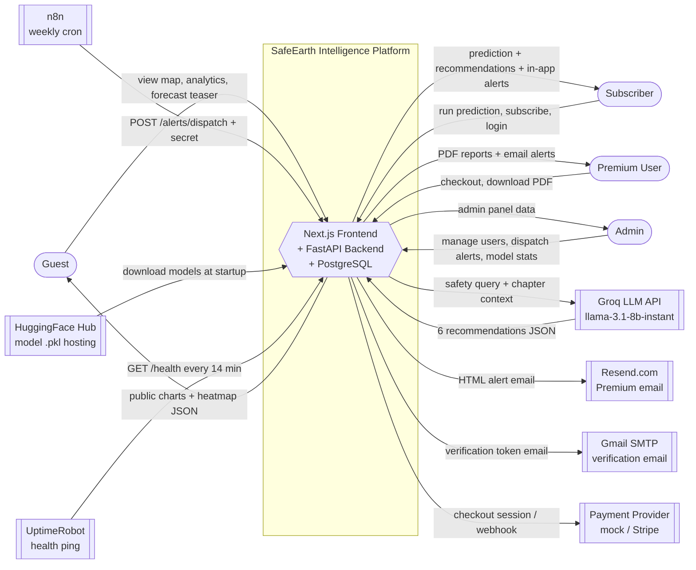
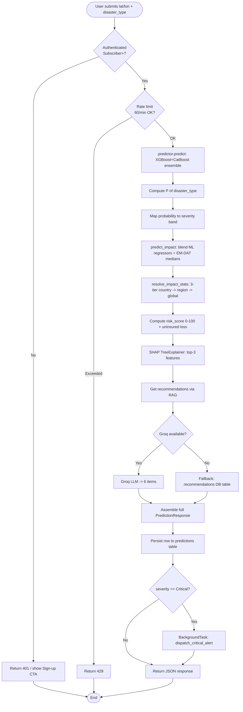
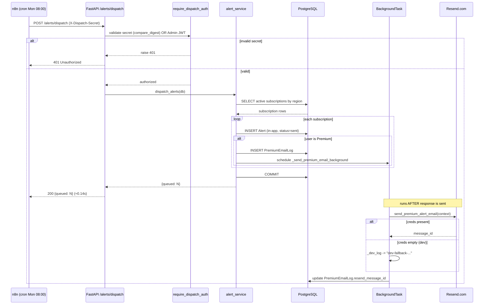
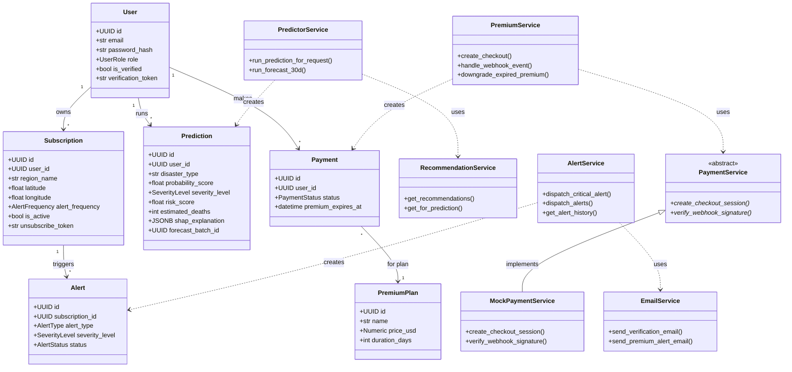
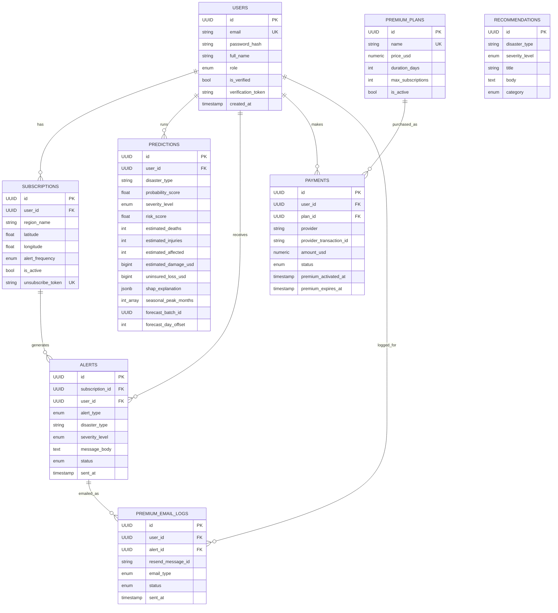
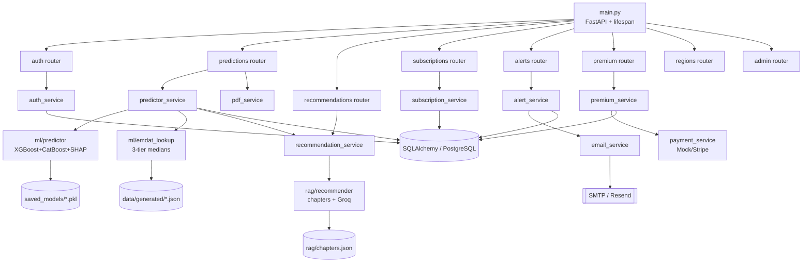

# SafeEarth Intelligence — System Design Diagrams

This document contains eight design diagrams for the SafeEarth Intelligence platform, each with an explanation. All diagrams use [Mermaid](https://mermaid.js.org/) (renders natively in GitHub and VS Code) except the UI wireframe, which is ASCII.

**System summary:** A web app that predicts natural disasters for any region (XGBoost + CatBoost on 16,126 EM-DAT events), estimates human/economic impact with SHAP explanations, alerts users by email, and generates AI safety recommendations via a chapter-based Groq RAG pipeline. Four roles: Guest, Subscriber, Premium, Admin.

---

## Table of Contents
1. [Context Diagram](#1-context-diagram)
2. [Use Case Diagram](#2-use-case-diagram)
3. [Activity Diagram — Disaster Prediction Flow](#3-activity-diagram--disaster-prediction-flow)
4. [Sequence Diagram — Alert Dispatch](#4-sequence-diagram--alert-dispatch)
5. [Class Diagram](#5-class-diagram)
6. [Entity Relationship Diagram (ERD)](#6-entity-relationship-diagram-erd)
7. [Structure Chart](#7-structure-chart)
8. [UI Wireframes — Public Dashboard](#8-ui-wireframes--public-dashboard)

---

## 1. Context Diagram

**What it shows:** SafeEarth as a single black box (Level-0 DFD) and every external entity it exchanges data with — human roles on the left, third-party services on the right. It answers "what is inside the system boundary and what is outside."



**Key flows explained:**
- **Humans (left):** Each role has a different read/write contract. Guests only consume public precomputed JSON; Subscribers gain the prediction pipeline; Premium adds email + PDF; Admin adds management.
- **Services (right):** Groq generates recommendations at request time; Resend/SMTP are outbound-only (email); n8n is inbound-only (it *calls* the system, never the reverse — an architectural rule); HuggingFace and the Payment Provider are dependencies the system reaches out to.
- The system boundary deliberately includes the database — PostgreSQL is internal state, not an external actor.

---

## 2. Use Case Diagram

**What it shows:** Every actor and the use cases each can perform. Mermaid has no native use-case notation, so actors are rounded nodes and use cases are pill-shaped, grouped by privilege tier. Higher tiers inherit everything below them (Subscriber ⊂ Premium ⊂ Admin).

```mermaid
flowchart TB
    GUEST([Guest])
    SUB([Subscriber])
    PREM([Premium])
    ADMIN([Admin])
    N8N([n8n / Scheduler])

    subgraph Public[Public — no login]
        UC1(View risk heatmap)
        UC2(View analytics / time series)
        UC3(View 30-day forecast teaser)
        UC4(Get safety recommendations)
        UC5(Register / Verify email / Login)
        UC6(Unsubscribe via email link)
    end

    subgraph SubArea[Subscriber+]
        UC7(Run disaster prediction)
        UC8(Run 30-day forecast)
        UC9(Manage region subscriptions - max 3)
        UC10(View prediction & alert history)
        UC11(Receive in-app alerts)
    end

    subgraph PremArea[Premium+]
        UC12(Receive HTML email alerts)
        UC13(Download PDF reports)
        UC14(Subscribe to up to 10 regions)
        UC15(Upgrade via checkout)
    end

    subgraph AdminArea[Admin only]
        UC16(Manage all users / roles)
        UC17(Manually dispatch alerts)
        UC18(View ML model stats)
    end

    GUEST --- UC1 & UC2 & UC3 & UC4 & UC5 & UC6
    SUB --- UC7 & UC8 & UC9 & UC10 & UC11
    PREM --- UC12 & UC13 & UC14 & UC15
    ADMIN --- UC16 & UC17 & UC18
    N8N --- UC17
```



**Key points explained:**
- **Tier inheritance:** A Premium user can still do everything a Subscriber can; the diagram only lists each tier's *new* capabilities to stay readable.
- **n8n as a non-human actor:** The scheduler triggers *Manually dispatch alerts* (UC17) on its weekly cron — the same use case an Admin can invoke manually. This reflects the dual-auth on `POST /alerts/dispatch` (X-Dispatch-Secret OR Admin JWT).
- **Personalisation:** *Get recommendations* (UC4) is public, but if the requester has a prior alert for the same disaster+region it prepends a "you were previously warned" notice — an `«extend»` relationship in formal UML.
- **Payment authority:** *Upgrade via checkout* (UC15) starts the flow, but role elevation happens only in the webhook handler — never from the frontend.

---

## 3. Activity Diagram — Disaster Prediction Flow

**What it shows:** The end-to-end control flow of `POST /predictions/predict`, from auth gate to the single JSON response, including the swimlane-style branch where Critical severity fires a background alert. This is the core ML request path.



**Key points explained:**
- **Two guard gates first:** Authentication (Subscriber+) and the slowapi rate limit (60/min) short-circuit before any ML work happens — cheap rejections protect the expensive path.
- **Impact is disaster-type aware:** `predict_impact` blends the location-aware ML regressors with EM-DAT disaster-type-specific medians (e.g. 70/30 for deaths), so a Flood and an Earthquake at the same coordinates return different numbers.
- **RAG never blocks the prediction:** If Groq is down, the flow silently falls back to the seeded `recommendations` DB table — a prediction never 500s because of RAG.
- **Critical = non-blocking fan-out:** When severity is Critical, alerts dispatch as a FastAPI `BackgroundTask` *after* the response is assembled, so the user still gets their result in one fast round-trip.
- **Always persisted:** Every prediction is saved to the DB (the response is returned in a single call with all fields together).

---

## 4. Sequence Diagram — Alert Dispatch

**What it shows:** The time-ordered message exchange when the weekly n8n cron triggers a dispatch, including the role-based fan-out (Subscriber → in-app only; Premium → in-app + email + log) and the non-blocking BackgroundTask for email.



**Key points explained:**
- **Dual auth up front:** `require_dispatch_auth` accepts either the machine secret (constant-time `secrets.compare_digest`) or an Admin JWT — the same endpoint serves both n8n and the Admin panel's "Manual Dispatch" button.
- **Role-based fan-out:** Free Subscribers get an in-app `Alert` row only; Premium users additionally get a `PremiumEmailLog` row and a scheduled email. This matches the strict "Subscribers receive no email" rule.
- **Response returns before email sends:** The HTTP response (`200 {queued: N}`) is committed and returned in ~0.14s; the actual Resend call happens in a `BackgroundTask` afterward, so dispatch is never blocked by SMTP/Resend latency.
- **Degrade-not-fail:** If Resend credentials are empty (current dev/prod state), the email path logs a `dev-fallback-...` sentinel instead of throwing — the dispatch still succeeds.
- **Same shape for Critical predictions:** The immediate Critical-severity path (`dispatch_critical_alert`) follows this exact pattern but opens its own `AsyncSessionLocal` because it runs after the request session has closed.

---

## 5. Class Diagram

**What it shows:** The backend's main classes across three layers — Pydantic/ORM data models, the service layer (business logic), and the abstract PaymentService strategy. Routers are intentionally thin and call only services, so they're omitted.



**Key points explained:**
- **Three layers:** Data models (top) are persisted SQLAlchemy entities; services (middle) hold *all* business logic; the strategy pattern (bottom) abstracts payments.
- **Strategy pattern for payments:** `PaymentService` is an ABC; `MockPaymentService` is the v1 implementation. Swapping to Stripe is a one-file change selected by the `PAYMENT_PROVIDER` env var — no router or service edits.
- **Service dependencies (dashed arrows):** `PredictorService` orchestrates the prediction (calling `RecommendationService` for RAG); `AlertService` uses `EmailService` for Premium emails; `PremiumService` is the sole authority that elevates a user's role (in `handle_webhook_event`).
- **Why no router classes:** Per the project's coding rules, routers contain no logic — they validate input and call a service — so the meaningful object model lives entirely in models + services.

---

## 6. Entity Relationship Diagram (ERD)

**What it shows:** All 8 database tables with their columns, primary/foreign keys, and cardinalities. This is the physical data model backing the entire app.



**Key points explained:**
- **Users is the hub:** Five tables hang off `users` via `user_id` FK (all `ON DELETE CASCADE`), making it the central entity.
- **RECOMMENDATIONS stands alone:** It has no FK — it's a static RAG *fallback* lookup table keyed by `(disaster_type, severity_level)`, used only when Groq is unavailable.
- **Forecast grouping:** `predictions.forecast_batch_id` (nullable UUID) groups the 30 rows of a single 30-day forecast; `forecast_day_offset` (0–29) orders them. A null batch id marks a single prediction.
- **Soft-delete & immutability rules:** Subscriptions use `is_active=False` rather than hard delete; `payments` rows are immutable (only status/timestamps update on the same row) for an audit trail.
- **Units worth noting:** `estimated_damage_usd` / `uninsured_loss_usd` are stored in **thousands** of USD; the frontend multiplies by 1,000 before formatting.

---

## 7. Structure Chart

**What it shows:** A top-down functional decomposition of the backend — how `main.py` delegates down through routers to services to the ML/RAG/data layers. Unlike the class diagram (objects), this shows *module call hierarchy* (who invokes whom).



**Key points explained:**
- **Strict layering:** `main.py` → routers → services → ml/rag/data. Control only flows downward; no router imports another router, and no router contains logic (it just calls one service).
- **predictor_service is the orchestrator:** It's the busiest module — it calls `ml/predictor` (the models), `ml/emdat_lookup` (impact medians), and `recommendation_service` (which in turn calls the Groq RAG), then persists to the DB.
- **Load-once resources (leaf data stores):** The `.pkl` models, generated JSON, and `chapters.json` are loaded a single time in the FastAPI lifespan and held in memory — never re-read per request.
- **Reading the chart:** Each box is a module/function; each arrow is a "calls" relationship. This is the classic structured-design view that complements the object-oriented class diagram.

---

## 8. UI Wireframes — Public Dashboard

**What it shows:** The low-fidelity layout of the public home page (`app/(public)/page.tsx`) as a Guest sees it — a Server Component that fetches `/regions/*` in parallel and renders hero stats, insight cards, a locked forecast teaser, and a features grid.

```
┌──────────────────────────────────────────────────────────────────────┐
│  🌍 SafeEarth Intelligence    Map  Analytics  Pricing      [ Log In ] │  ← Nav (guest)
├──────────────────────────────────────────────────────────────────────┤
│                                                                        │
│        Predict Natural Disasters Anywhere on Earth                     │
│        AI-powered risk, impact estimates & safety guidance            │  ← Hero
│              [ Explore Risk Map ]   [ Sign Up Free ]                   │
│                                                                        │
├──────────────────────────────────────────────────────────────────────┤
│   ┌───────────┐   ┌───────────┐   ┌───────────┐                        │
│   │  13,939   │   │     8     │   │     5     │                        │  ← Stat tiles
│   │  events   │   │ disaster  │   │continents │                        │   (from JSON)
│   │ 1900–2021 │   │  types    │   │  covered  │                        │
│   └───────────┘   └───────────┘   └───────────┘                        │
├──────────────────────────────────────────────────────────────────────┤
│   ┌──────────────────────────┐  ┌──────────────────────────┐          │
│   │ 📈 Floods grew 3.3×       │  │ 🛡️ Insurance gap          │          │  ← Insight cards
│   │ 524 (1980s) → 1,725       │  │ Earthquake 17% • Flood    │          │   (live values)
│   │ (2000s)                   │  │ 26% of damage covered     │          │
│   └──────────────────────────┘  └──────────────────────────┘          │
├──────────────────────────────────────────────────────────────────────┤
│   30-Day Forecast                              🔒 Sign up to unlock    │
│   ┌──┬──┬──┬──┬──┬──┐   ╳ ╳ ╳ ╳ ╳ ╳   (blurred 5×6 grid teaser)        │  ← Forecast teaser
│   ├──┼──┼──┼──┼──┼──┤   ╳ ╳ ╳ ╳ ╳ ╳                                     │   (zero API calls,
│   └──┴──┴──┴──┴──┴──┘   ╳ ╳ ╳ ╳ ╳ ╳        [ Create Free Account ]     │    guest-only)
├──────────────────────────────────────────────────────────────────────┤
│   Why SafeEarth?                                                       │
│   ┌────────────────┐ ┌────────────────┐ ┌────────────────┐            │
│   │ 🎯 Predictions │ │ 🗺️ Risk Map     │ │ 📨 Alerts       │            │  ← Features grid
│   │ ML + SHAP      │ │ Leaflet heatmap │ │ Email & in-app  │            │
│   └────────────────┘ └────────────────┘ └────────────────┘            │
├──────────────────────────────────────────────────────────────────────┤
│   © SafeEarth Intelligence · Data: EM-DAT (1900–2021)                  │  ← Footer
└──────────────────────────────────────────────────────────────────────┘
```

**Key points explained:**
- **Server-rendered, data-driven:** The page is a Next.js Server Component that fetches `/regions/trends` + `/regions/continent-stats` in parallel (revalidate 3600s). The stat tiles and insight cards show *live* values computed from the precomputed JSON — not hardcoded.
- **Guest-locked forecast teaser:** The 5×6 grid is purely decorative (blurred, zero API calls). Its only action is the "Create Free Account" CTA → `/register`. The real forecast lives behind auth at `/dashboard/forecast`.
- **Auth-aware nav:** As a Guest, the nav shows only public links + "Log In". After login it swaps to a role badge, dashboard links, and a Log Out button (rendered by the `Nav` client component).
- **Two primary CTAs in the hero** route to the two entry points: explore the map (public) or sign up (to unlock predictions). Every visible string comes from `lib/strings.ts` (no hardcoded UI text).

---

*Generated for SafeEarth Intelligence v1. Diagrams reflect the architecture documented in CLAUDE.md.*
